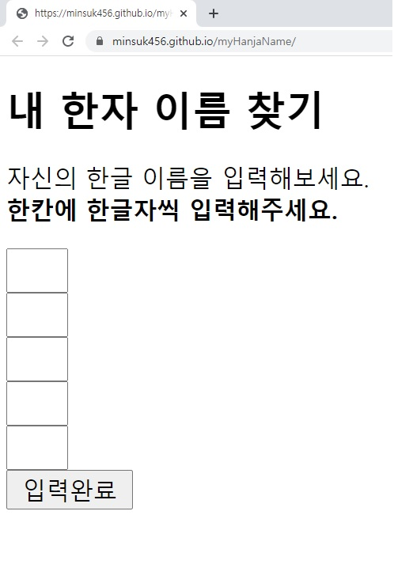
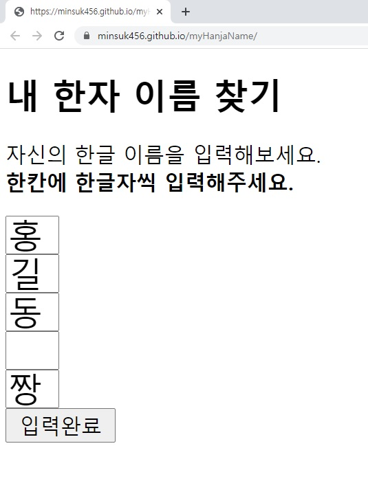
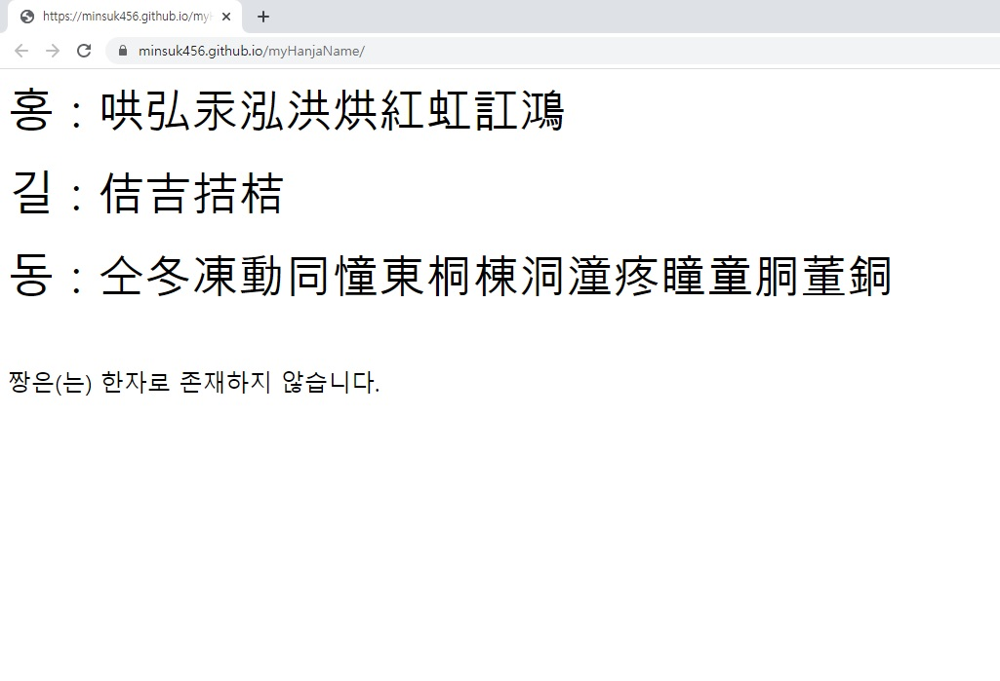

# myHanjaName

---
**myHanjaName프로젝트**는 자신의 한자 이름을 찾을 수 있게 도와주는 도구 개발 프로젝트입니다.
- 이러한 프로젝트를 **선정한 이유** : 제작자가 이전에 인감을 제작해야 하는 상황에서
자신의 한자이름을 정확히 어떻게 쓰는지 기억이 안나 곤란함을 느꼈던 적이 있었습니다.
이와 같이 자신의 한자이름을 대충 알고는 있지만 정확히 기억해내야할때
나열된 한자들중에서 고를 수 있게 도와주는 도구가 있으면 좋겠다고 느꼈습니다.
- 이에 따라 **프로젝트의 목표**는 자신의 한자이름을 찾을 수 있게 도와줘야 합니다.
편리할수록, 그리고 기능이 많을수록 좋다고 생각하기에 계속 추가해 나갈 예정입니다.
- 현재는 제작자인 저로 구성된 1인 프로젝트입니다.
참여하고 싶으시다면 언제든지 프로젝트를 수정 및 추가해서 커밋하시면 됩니다.
저와 연락하시고 싶으시면 **zndznd789@gmail.com**으로 이메일 보내시면 됩니다.

---

 - **이용방법** : 자신의 한글 이름을 한 글자씩 입력하고 입력완료 버튼을 누르시면 글자에 해당하는 한자들이 나열된 페이지로 넘어갑니다.
한자가 존재하지 않는 한글의 경우 코멘트를 해드립니다. 새로고침 하시면 처음 입력 페이지로 돌아갑니다.

**메인화면**

**입력예시**

**출력예시**

 - 이후 추가될 기능 :
   * 한자들의 음훈까지 입력했을 시 그에 맞는 한자 바로 알려주기
	* 나열된 한자들의 음훈까지 알려주기
	 * 한자들의 간자체 버전과 중국어 발음까지 알려주기

---
[참조링크](http://egloos.zum.com/byulbada/v/2224585)
